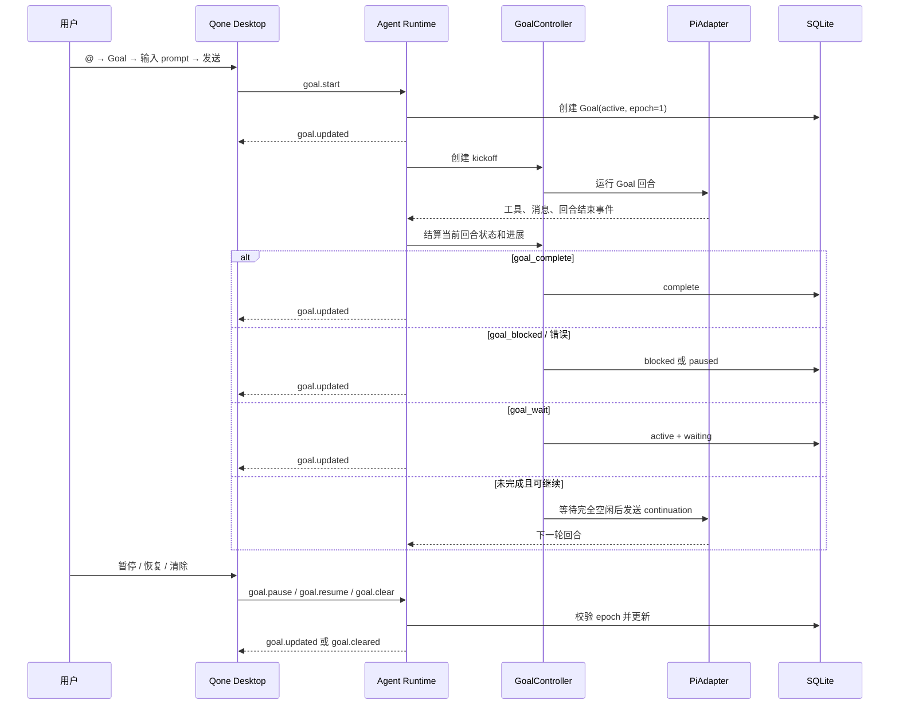

# Qone Goal 目标模式设计

> 状态：已按本文档实施，本文档记录当前实现约束。
>
> 目标：把长期目标能力放入聊天输入框的 `@` 入口，支持设置、持续执行、暂停、恢复、完成、阻塞、等待外部事件和状态展示。

## 1. 结论

Qone 应该实现自己的 Goal 目标模式，不直接安装 `@schovest/pi-goal`。

实现方案采用两部分：

1. **采用 Codex CLI 的架构**：Goal 是当前会话的持久实体，拥有明确状态、事件和控制协议。
2. **采用 pi-goal 的运行机制**：模型回合结束后在安全的空闲边界自动继续，增加完成、阻塞和等待工具。

Goal 在 Qone 中属于 **会话级运行功能**，不是 Skill，也不是 MCP：

- Skill 提供工作方法和提示词；
- MCP 提供外部工具；
- Goal 保存用户要达成的目标，并驱动 Agent 持续完成它。

当前版本的 `/` 补全只包含 Skill 和 MCP，`Goal` 应该进入 `@` 的工具入口，并作为一个独立的“目标”卡片展示。

## 2. 为什么不直接安装 pi-goal

`@schovest/pi-goal` 是 Pi 扩展包，提供 `/goal` 命令、Goal 工具、Pi 生命周期监听和 Pi 会话状态保存。它的目标执行机制值得采用，但直接接入 Qone 有四个结构问题：

| 问题 | Qone 当前情况 | 直接安装的影响 |
|---|---|---|
| 扩展加载 | [skills.ts](../apps/agent-runtime/src/skills.ts) 创建 `DefaultResourceLoader` 时设置了 `noExtensions: true` | 需要改变现有扩展安全边界 |
| 状态持久化 | Qone 使用 SQLite、`SessionRepo`、`RunRepo` 和 NDJSON 协议 | pi-goal 的 Pi session state 不能直接替代 Qone 的会话状态 |
| UI | Qone 使用 React、assistant-ui 和自有 Composer | pi-goal 的 `/goal` TUI 不能复用 |
| 运行入口 | [PiAdapter](../apps/agent-runtime/src/pi-adapter.ts) 把 Pi 运行封装为 Qone 的 `agent.run` | 需要额外处理 Goal 回合、权限、消息显示和并发竞态 |

直接安装还会造成两个目标状态来源：pi-goal 维护一套状态，Qone UI 和数据库维护另一套状态。后续暂停、重启、切换会话和恢复运行时容易出现不一致。

## 3. 两个参考实现的比较

### 3.1 Codex CLI 的优点

当前 Codex CLI 已将 Goal 作为线程级能力实现。Qone 只采用它的目标实体和生命周期思想：

- Goal 数据包含线程、目标正文、状态、创建时间和更新时间；
- 状态包括 `active`、`paused`、`blocked`、`complete`，外部等待作为 active 的等待标记；
- 有独立的 Goal set/get/clear 协议和更新事件；
- Goal 运行时由核心服务控制，而不是依赖一段普通提示词；
- `get_goal`、`create_goal`、`update_goal` 工具拥有清晰的状态变更边界；
- 用户状态变更和模型状态变更分开处理；
- 状态栏只显示目标状态和目标正文摘要。

这套设计适合 Qone 的 SQLite、Runtime 和桌面端。尤其是“目标是会话实体”这一点，可以直接对应 Qone 的 `sessionId`。

### 3.2 pi-goal 的优点

`pi-goal` 对 Pi 运行过程处理得更具体，适合作为自动执行机制的参考：

- 监听 Agent 完全结束后的空闲边界，再发送下一轮 continuation；
- 避免同一个 Goal 重复派发 continuation；
- 用 Goal id 或运行代次阻止旧回合修改新目标；
- 不设置自动回合上限，也不根据输出相似度主动截断；
- 由模型自己调用完成工具结束目标；
- 只区分用户暂停、真正阻塞和目标完成；
- 提供 `goal_complete`、`goal_blocked`、`goal_wait`；
- 支持等待外部事件，并在用户输入或定时器触发后继续；
- 支持会话重载后恢复未完成目标。

它的主要限制是：

- UI 以 Pi TUI 的 `/goal` 为中心；
- 状态保存模型是 Pi session state，不是 Qone 的数据库；
- 依赖 Pi 的扩展生命周期和特定事件；
- managed-run RPC 只适合可信的 Pi sibling extension，不适合作为 Qone 的 GUI 协议；
- 它是单目标自动执行器，不负责 Qone 已有的子代理树和 workflow。

### 3.3 Qone 的选择

| 能力 | 采用方案 |
|---|---|
| Goal 数据模型 | Codex |
| 会话级持久化 | Qone SQLite |
| GUI 控制协议 | Qone NDJSON |
| Goal UI | Qone `@` Popover + 轻量状态入口 |
| 自动续跑 | pi-goal 的空闲边界和单飞保护 |
| 状态边界 | Codex 的显式状态转换 |
| 完成/阻塞/等待工具 | pi-goal 的参数和证据约束，结合 Qone 当前会话 |
| 子代理协作 | 复用 Qone 现有 `dispatch_subagent`、workflow 和运行树 |
| Pi 扩展包 | 不引入 |

## 4. 用户体验

### 4.1 唯一入口：`@` 选择 Goal，再输入目标

现有 [composer-triggers.tsx](../apps/desktop/src/components/assistant-ui/composer-triggers.tsx) 已经使用 assistant-ui 的 `@` Popover。Goal 直接作为其中一个能力条目，不新增目标表单、独立页面或复杂设置流程。

用户操作只有三步：

```text
1. 输入 @
2. 选择 Goal
3. 在 Goal 后面输入 prompt 并发送
```

示例：

```text
@goal 修复上传失败问题，并运行相关测试
```

这里的整段 prompt 就是目标。发送后：

- `@goal` 是 Composer 的 Goal 指令标记；
- `修复上传失败问题，并运行相关测试` 是目标正文；
- 目标正文作为普通用户消息保存在当前会话；
- 这条消息继续使用现有的编辑、删除、重试和替换消息能力；
- Runtime 根据该消息创建并启动当前会话的 Goal。

Skill 和 MCP 继续保留在 `/` 中，不改变已有输入行为。Goal 不伪装成 Skill，也不要求用户学习 `/goal` 命令。

### 4.2 Goal 消息的编辑和删除

Goal 消息就是一条普通用户消息，只增加一个内部 `goal` 标记和关联的 Goal id。聊天列表中可以显示一个轻量的“目标”标识，不改变消息结构和操作菜单。

- 编辑 Goal 消息：使用现有的替换消息流程，旧 Goal epoch 失效，按新的目标重新开始；
- 删除 Goal 消息：按现有消息删除规则清理关联 Goal 和未完成的自动续跑；
- 重试 Goal 消息：重新创建该目标的当前执行回合，不复用已失效的旧 epoch；
- 新发送另一条 `@goal` 消息：如果当前 Goal 未完成，沿用现有消息替换确认逻辑，确认后切换到新目标；
- 普通消息不会自动变成 Goal，也不会因为当前存在 Goal 而被强制改写。

### 4.3 运行状态的最小展示

创建目标不需要额外参数。Goal 会持续运行，直到模型调用完成工具、模型明确报告阻塞、用户暂停或运行发生错误。

运行期间只保留一个轻量状态入口：

```text
Goal · 执行中
```

点击状态入口后提供必要操作：

- 暂停；
- 恢复；
- 清除；
- 查看当前目标和停止原因。

状态入口可以放在 Composer 工具按钮附近或当前 Goal 消息旁边，复用现有 Popover 和消息操作样式，不新增独立 Goal 页面。

完成、阻塞和等待只作为运行状态展示，不要求用户在发送目标时填写任何字段。

## 5. Goal 状态模型

### 5.1 状态

```text
                ┌────────────┐
                │   active   │◄──────────────┐
                └─────┬──────┘               │
          complete    │                       │ resume / user input
             ┌────────┼────────┐              │
             ▼        ▼        ▼              │
        complete    paused   waiting           │
                        │        │             │
                        ▼        └─────────────┘
                     blocked
                        │
                        └──────────────► active

```

`waiting` 是 Qone 的运行状态标记，建议不作为终态枚举，而是用 `status = active` 加 `waitingUntil` / `waitingReason` 表示。这样外部事件到达后可以恢复同一个目标实例，避免把等待误认为已经暂停或完成。

### 5.2 状态规则

- `active`：目标允许自动继续；
- `paused`：用户主动暂停，禁止自动继续；
- `waiting`：模型明确声明正在等外部事件，禁止普通自动继续；用户输入或到期计时器可以唤醒；
- `blocked`：模型明确报告真实阻塞，或 Runtime 发生不可恢复的运行错误；
- `complete`：模型通过完成工具报告完成，且工具参数和当前 Goal id 有效。

模型只有在证据充分时才能标记 `complete` 或 `blocked`。Runtime 不根据回合次数、输出长度或输出相似度中断 Goal。

## 6. 数据模型

已新增独立的 `goals` 和 `goal_events` 表，不把 Goal 字段塞进 `sessions`。Goal 有自己的生命周期和审计事件，同时不影响旧会话数据。

### 6.1 `goals`

| 字段 | 类型 | 说明 |
|---|---|---|
| id | text | Goal 实例 id，替换目标时生成新 id |
| session_id | text | 所属 Qone 会话 |
| objective | text | 用户目标 |
| status | text | `active/paused/blocked/complete` |
| waiting_reason | text nullable | 外部等待原因 |
| waiting_until | integer nullable | 可选绝对唤醒时间 |
| stop_reason | text nullable | 暂停、阻塞或错误原因 |
| run_options | text nullable | 目标启动时的模型、权限模式和思考级别 JSON；用于重启恢复 |
| epoch | integer | 每次恢复、编辑或替换时递增，阻止旧回合写入新状态 |
| created_at | integer | 创建时间 |
| updated_at | integer | 更新时间 |

约束：

- 同一个 `session_id` 同时只能有一个未完成 Goal；
- `complete` Goal 可以被新 Goal 替换；
- `id` 和 `epoch` 同时参与自动回合写入校验；
- 清除 Goal 不能删除聊天消息和普通运行记录，只删除 Goal 记录及其 Goal 事件。

### 6.2 `goal_events`

保存用户操作、状态变化、自动续跑、阻塞原因和完成证据的摘要：

```text
id, goal_id, session_id, run_id, type, payload_json, created_at
```

事件 payload 不保存完整敏感工具结果，只保存状态变化所需的有限摘要。完整工具调用继续由现有 `tool_calls` 表保存。

### 6.3 运行记录关联

扩展现有 `runs`：

- `origin`: `manual | goal_kickoff | goal_continuation | goal_resume | goal_edit`；
- `goal_id` nullable；
- `goal_epoch` nullable；

这样可以区分用户主动发送的回合和 Goal 自动发起的回合，避免把自动续跑当作用户消息，也方便统计和恢复。

## 7. 协议设计

### 7.1 GUI 到 Runtime

在 `packages/protocol/src/index.ts` 增加：

```text
goal.get       读取当前会话 Goal
goal.start     接收 @goal 消息并创建或替换目标
goal.pause     用户暂停
goal.resume    恢复暂停或阻塞目标
goal.clear     清除目标
```

不增加目标设置协议。目标正文来自 `@goal` 后面的用户 prompt；编辑目标直接复用现有的 `agent.run` 替换消息流程。

所有命令都携带 `sessionId` 和 `requestId`。`goal.start` 返回完整 Goal 快照，替换目标沿用现有消息替换的确认逻辑。

### 7.2 Runtime 到 GUI

增加：

```text
goal.current       当前会话 Goal 快照
goal.updated       Goal 状态或目标文本变化
goal.cleared       Goal 已清除
goal.error         Goal 操作失败
```

Goal 状态通过独立的 Goal 表和 `goal_events` 持久化；切换会话或 Runtime 重启后，UI 通过 `goal.get` 读取当前快照。

### 7.3 模型工具

Goal 开启后，Pi 会话中增加以下受权限和 Goal epoch 保护的工具：

#### `get_goal`

读取当前目标、状态、等待原因和停止原因。

#### `goal_complete`

```json
{
  "summary": "已完成的结果和验证证据"
}
```

Runtime 必须校验：

- 工具调用绑定的 Goal id、epoch 和 run id 仍然有效；
- Goal 仍然处于 `active`；
- summary 不包含“未完成”“测试仍失败”等明显矛盾内容；
- 当前回合没有仍未结束的工具调用；
- 如果目标要求测试、构建或验证，summary 必须包含对应证据。

#### `goal_blocked`

```json
{
  "reason": "阻塞原因",
  "evidence": "已尝试的路径和失败证据"
}
```

模型只能在存在真实阻塞并给出证据时标记 `blocked`。Runtime 不按阻塞次数、回合次数、输出长度或 token 预算限制目标。

#### `goal_wait`

```json
{
  "reason": "等待用户登录或外部任务完成",
  "resume_after_ms": 60000
}
```

等待会暂停自动续跑，但保留目标和进度。用户输入、外部事件或到期计时器可以触发恢复。

Goal 工具只在有目标时暴露给模型；旧回合携带的工具调用在 Goal 被暂停、清除、替换或进入终态后必须拒绝。

## 8. Runtime 执行流程



### 8.1 启动

1. UI 发 `goal.start`。
2. Runtime 校验会话和工作区仍存在。
3. 如果存在未完成 Goal，先停止旧回合并清理旧 Goal 状态。
4. 创建新的 Goal id 和 epoch。
5. 记录 `goal_kickoff` 运行。
6. 通过 PiAdapter 运行第一轮。

### 8.2 自动续跑

当前 Qone 的 `PiAdapter.run()` 会在 Pi 一轮完成后返回。首期可在 Runtime 的运行完成处理器中实现单飞续跑，不必强行加载 Pi 扩展。

续跑前必须同时满足：

- 当前 Goal 仍是相同 id 和 epoch；
- Goal 仍为 active；
- 当前 session 没有用户新消息、审批、steer 或 follow-up 排队；
- Pi session 已经 idle；
- 没有另一个 continuation 正在派发；
- 必要 Goal 工具仍在当前工具集合中。

续跑 prompt 使用内部 Goal continuation 消息，不作为用户消息显示。它必须包含当前目标、已完成进展、上一轮结果摘要和“继续工作并在完成时调用完成工具”的指令，但不重复复制全部聊天历史。

### 8.3 用户输入优先级

- 用户暂停在任何自动 continuation 派发前生效；
- 用户新输入会取消待派发 continuation，但不自动清除 Goal；
- 用户新输入完成后，Goal 仍 active 时再按结算规则决定是否继续；
- 清除或替换 Goal 会递增 epoch，使旧 continuation、旧工具调用和旧定时器全部失效；
- 自动 continuation 永远不能覆盖用户最新的运行。

### 8.4 重启恢复

Runtime 启动时：

- 加载所有未完成 Goal；
- active Goal 在确认没有活动 run 后自动安排一次 continuation；
- UI 通过 Goal 快照显示当前状态；
- 用户点击恢复后再创建新的 epoch 和 continuation；
- waiting Goal 恢复其等待原因和绝对截止时间，不计算离线时间；
- 已有的 `running` run 仍按现有逻辑标记为 interrupted。

## 9. 权限和安全边界

Goal 不改变外部工具权限。Goal 只是控制回合调度，文件、命令、网络和 MCP 仍经过当前 [permissions.ts](../apps/agent-runtime/src/permissions.ts) 的确认流程；`get_goal`、`goal_complete`、`goal_blocked`、`goal_wait` 只读写当前 Goal 状态，不请求外部能力审批。

必须额外处理：

- 自动续跑不能绕过用户的工具审批；
- 等待审批不算 Goal 完成，也不触发下一轮；
- Goal 工具必须绑定 `goalId + epoch + runId`；
- Goal 清除后，旧工具调用返回“目标已失效”；
- 目标文本和事件摘要不得记录 API key、cookie 或完整敏感工具输出；
- 自动续跑要有全局单飞锁，不能因为重复完成事件派发两轮；
- 自动续跑运行错误直接记录为阻塞，不机械重复派发同一路径。

## 10. 实施文件范围

### Protocol / database

- `packages/protocol/src/index.ts`：Goal 命令、事件、状态和快照类型；
- `packages/database/src/schema.ts`：`goals`、`goal_events` 和运行关联字段；
- `packages/database/src/repos.ts`：Goal 查询、更新、事件和 epoch 校验；
- `packages/database/drizzle/0003_goals.sql`：旧数据库兼容迁移。

### Runtime

- `apps/agent-runtime/src/index.ts`：状态机、续跑调度、Goal 命令和持久化事件；
- `apps/agent-runtime/src/pi-adapter.ts`：Goal 工具注入和内部回合执行；
- `apps/agent-runtime/src/index.ts`：处理 Goal 命令、恢复、事件和主运行完成后的 Goal 结算。

不会把 Goal 逻辑塞进 [subagent-runner.ts](../apps/agent-runtime/src/subagent-runner.ts)。Goal 是主会话能力，子代理仍由现有运行树和 workflow 管理。

### Desktop

- `apps/desktop/src/components/assistant-ui/composer-triggers.tsx`：在 `@` Popover 加入 Goal 入口；
- `apps/desktop/src/components/assistant-ui/composer-tools.tsx`：Goal 指令条目；
- `apps/desktop/src/components/assistant-ui/Thread.tsx`：显示 Goal 状态入口；
- `apps/desktop/src/App.tsx`：解析 `@` Goal directive 并把后续 prompt 发送为目标正文；
- `apps/desktop/src/store.ts`：发送 Goal 消息、接收 Goal 状态和调用暂停/恢复/清除；
- `apps/desktop/src/i18n/zh-CN.ts`、`en.ts`：Goal 文案。

不新增目标表单、独立页面或独立 Goal 编辑器。

## 11. 分阶段实施

### 阶段一：状态和协议（已完成）

- 新增 Goal 类型、SQLite 表和迁移；
- 让 `@goal prompt` 创建 Goal，并保留为普通用户消息；
- 实现 get/pause/resume/clear；
- 让消息编辑、删除和重试复用现有流程；
- 实现 Goal 快照读取和 Runtime 重启恢复；
- 完成状态转换单元测试。

验收：用户发送一条 `@goal prompt` 即可创建目标，旧数据库可以正常启动，目标消息可以使用现有消息操作。

### 阶段二：模型工具和单轮结算（已完成）

- 注入 Goal 工具；
- 实现完成、阻塞、等待校验；
- 记录运行来源；
- 处理旧 Goal epoch 和失效工具调用。

验收：模型只能操作当前 Goal；完成和阻塞由 Runtime 绑定当前 Goal 校验；清除后旧工具调用不能改变状态。

### 阶段三：自动续跑（已完成）

- 增加内部 Goal 回合；
- 增加单飞锁、用户输入优先级和 idle 检查；
- 增加运行错误处理和重启恢复。

验收：一个目标可以持续推进直到模型完成；不会重复派发；用户可以暂停和恢复；用户新输入不会被自动回合覆盖。

### 阶段四：`@` UI（已完成）

- 在 `@` Popover 中加入 Goal；
- 选择后插入 `@goal` 指令，用户继续输入 prompt；
- 发送时把 prompt 作为目标正文；
- 显示轻量 Goal 状态入口；
- 复用现有消息编辑、删除、重试和确认替换；
- 增加中英文文案和键盘操作。

验收：用户只需要 `@` → `Goal` → 输入 prompt → 发送，不需要填写第二份目标内容，也不需要使用 `/goal`。

### 阶段五：完整验证（已完成）

- `bun test apps/agent-runtime/test`；
- 新增 Goal 状态、epoch、续跑竞态和恢复测试；
- `bun run --cwd apps/agent-runtime typecheck`；
- `bun run --cwd apps/desktop build`；
- `git diff --check`。

不启动浏览器验收。

## 12. 验收标准

- `@` 菜单中有明确的“目标”入口；
- 可以创建、编辑、暂停、恢复、等待、清除和完成 Goal；
- Goal 与当前会话绑定，切换会话后状态不串；
- Runtime 重启后会根据持久化 Goal 状态恢复等待计时或安排一次 continuation；
- Goal 自动续跑不会显示成用户发送的普通消息；
- 完成、阻塞和等待状态可区分；
- 旧 Goal 回合和工具调用不能覆盖新 Goal；
- MCP、Skill、子代理和现有权限流程不回归；
- 不依赖 `@schovest/pi-goal` 的 TUI、Pi session state 或 managed-run RPC。

## 13. 参考资料

- [pi-goal package](https://pi.dev/packages/@schovest/pi-goal?name=goal)
- [pi-goal README 0.2.0](https://cdn.jsdelivr.net/npm/@schovest/pi-goal@0.2.0/README.md)
- [Codex CLI slash command source](https://github.com/openai/codex/blob/main/codex-rs/tui/src/slash_command.rs)
- [Codex ThreadGoal type](https://github.com/openai/codex/blob/main/codex-rs/app-server-protocol/schema/typescript/v2/ThreadGoal.ts)
- [Codex ThreadGoal status](https://github.com/openai/codex/blob/main/codex-rs/app-server-protocol/schema/typescript/v2/ThreadGoalStatus.ts)
- [Codex Goal runtime](https://github.com/openai/codex/blob/main/codex-rs/ext/goal/src/runtime.rs)
- [Codex Goal tool specification](https://github.com/openai/codex/blob/main/codex-rs/ext/goal/src/spec.rs)

